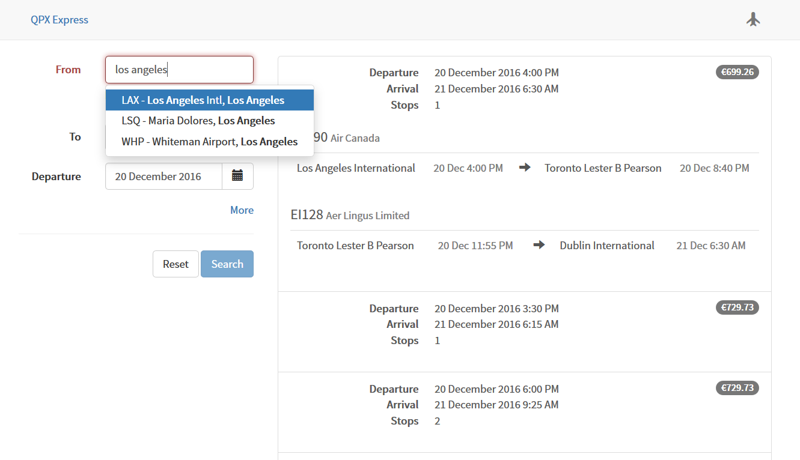

# Flights search app

Flights search app powered by the [QPX Express API](https://developers.google.com/qpx-express/)

## Components

* [AngularJS](http://angularjs.org/)
* [Redux](https://github.com/reactjs/redux)
* [Angular-UI Bootstrap](https://github.com/angular-ui/bootstrap)
* [Airport Codes](https://github.com/akenn/airport-codes)

## Instructions

1. Clone this repository (`$ git clone https://github.com/samihda/qpx-app.git`)
2. Navigate into the cloned directory and run `$ npm install` from there to install dependencies
3. Run `$ webpack` to build the source code, then access the standalone app at `dist/`
4. Alternatively, just run `$ npm start` to serve the built source code from memory using [webpack-dev-server](https://github.com/webpack/webpack-dev-server) at [localhost:8080](http://localhost:8080/)

*Note: requires an API key in [`src/services/data.service.key.js`](https://github.com/samihda/qpx-app/blob/master/src/services/data.service.key.js)*
